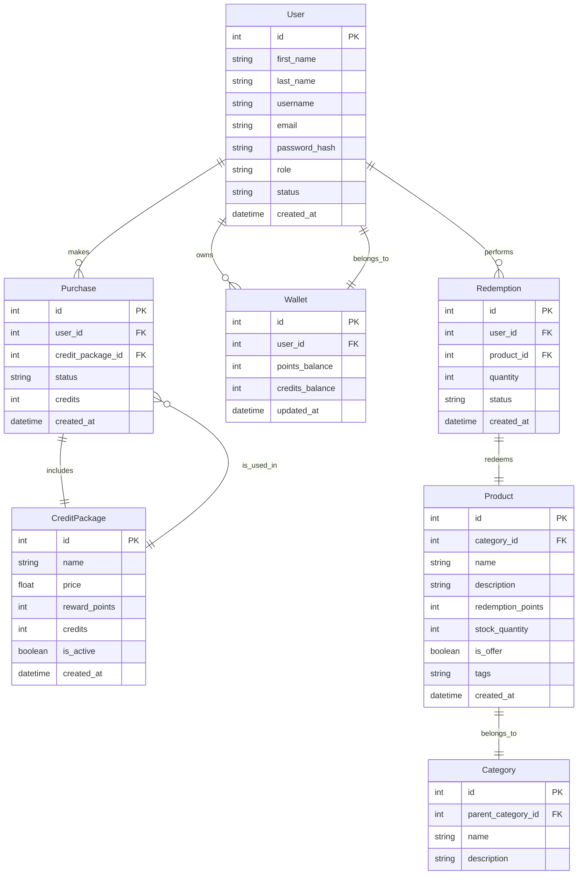

# Reward-Based Credit System

A scalable **Go** backend for credit purchases, reward point redemptions, and admin-managed product offers. Includes
search, Docker support, and AI recommendations.

---

## 🚀 Features

- 🧾 **User Authentication** (Register/Login)
- 💳 **Credit Purchase System**
- 🎁 **Product Redemption via Points**
- 🏦 **Wallet Management** (Credits & Points)
- 🛒 **Admin Dashboard** (Stats, User Management, Moderation)
- 🧠 **AI Product Recommendations** (Mock LLM support)
- 📦 **Modular**: Clean separation into Repository, Service, Handler, and API layers

---

## 📐 System Design Overview

### 📘 ERD Snapshot

Below is the ERD represented in Mermaid format:



### 📐 Design Phase & Documentation

This project began with a carefully planned design phase to ensure consistency, maintainability, and scalability from
the ground up. All design assets and documents are stored under the `/design` directory.

#### 📁 /design Directory Contents

| File Name       | Description                                                                  |
|-----------------|------------------------------------------------------------------------------|
| `api-design.md` | Full documentation of the API endpoints, request/response formats, and rules |
| `db-ddl.sql`    | Raw SQL schema used for initial database structure before GORM auto-migrate  |
| `seed.sql`      | Sample data for categories, users, products, and credit packages             |

These files provide a clear blueprint of the system’s behavior and database schema, which greatly helped in implementing
the actual system with minimal changes and high clarity.

### ⚙️ Clean Architecture

```text
internal/
│
├── repository/ → GORM-based data access logic
├── service/ → Core business logic and rule enforcement
├── handler/ → HTTP layer (Gin)
├── api/ → Route definitions
├── migration/ → Auto schema migration on startup
├── store/ → GORM models (User, Wallet, Product, etc.)
├── types/ → DTOs, shared structs
└── app/ → DI: modules wiring & bootstrapping
```

## 🧰 Tech Stack

- Language: **Go**
- HTTP Framework: **Gin**
- ORM: **GORM**
- Database: **PostgreSQL**
- Auth: **JWT**
- Docs: **Swagger (swaggo)**

---

## ⚒️ Setup Instructions

### 1. Clone the Repo

```bash
git clone https://github.com/youssef-ahmmed/Reward-Based-Credit-System.git
cd Reward-Based-Credit-System
```

### 2. Run with Docker Compose

```bash
docker-compose up --build
```

This will start:

- PostgreSQL (default port: `5432`)
- Go API service (on [http://localhost:8080](http://localhost:8080/swagger/index.html))
- Swagger docs (on [http://localhost:8080/swagger/index.html](http://localhost:8080/swagger/index.html))

### 3. Auto Migrations

Tables are auto-created on boot using `gorm.AutoMigrate()` based on models in `internal/store`.

---

## 📊 API Documentation

All APIs are documented using Swagger.

> 🔗 Access after docker-compose up:
>
> [http://localhost:8080/swagger/index.html](http://localhost:8080/swagger/index.html)


---

## 🧪 Sample Test Data

### SQL Dump

You can load sample test data with:

```bash
psql -U postgres -d rewards_db < seed/seed.sql
```

---

## 🧠 AI Recommendation Feature

### Endpoint

```POST /api/ai/recommendations```

### Sample Payload

```json
{
  "user_preferences": {
    "categories": [
      "e8bfe5ba-5624-4ba5-b895-0a99fe45e293",
      "8245b1f5-2882-47a6-a78a-68c5b3190ce7"
    ],
    "price_range": {
      "min_points": 100,
      "max_points": 1000
    },
    "exclude_categories": [
      "e3b8f0a2-0118-4d40-80ca-1b07894fdd40"
    ]
  },
  "limit": 5,
  "context": "homepage"
}
```

### How it works:

* Filters products by category, exclusion list, point range.
* Scores items using mocked logic.
* Returns top N products with `confidence_score` and a reasoning message.
* It Can be extended to real **LLM-based recommendations** (OpenAI, Anthropic, etc.).

---

## 🛡️ Admin Routes Highlights

| Endpoint                        | Method   | Description                      |
|---------------------------------|----------|----------------------------------|
| `/admin/dashboard`              | **GET**  | Stats (users, purchases, points) |
| `/admin/users`                  | **GET**  | List users with filters          |
| `/admin/users/:id/credits`      | **POST** | Add/subtract user credits        |
| `/admin/users/:id/points`       | **POST** | Add/subtract user points         |
| `/admin/users/:id/status`       | **PUT**  | Suspend/ban/reactivate users     |
| `/admin/redemptions/:id/status` | **PUT**  | Approve/reject redemptions       |

---

## 📦 Build & Deploy with GitHub Actions

This project supports CI/CD via GitHub Actions:

- ✅ On push to `master`:
    * Go Linting
    * Build tests
    * Docker image build

(See `.github/workflows/workflow.yml`)

---

## 🧑‍💻 Contributing

Want to contribute? Submit a PR or open an issue. We're happy to review improvements, AI integrations, and frontend
ideas.

---

## 📄 License

This project is licensed under the MIT License.

---

## 🙏 Acknowledgements

1. [Gin](https://github.com/gin-gonic/gin)
2. [GORM](https://gorm.io/)
3. [swaggo/swag](https://github.com/swaggo/swag)
4. [PostgreSQL](https://www.postgresql.org/)
5. [Docker](https://www.docker.com/)